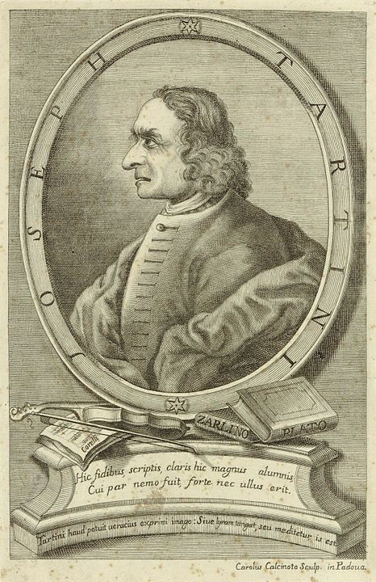

<html>
<head>
  <meta http-equiv="Content-Type" content="text/html; charset=utf-8"/>
  <link rel="stylesheet" href="https://www.w3schools.com/w3css/4/w3.css">
</head>

<body>

We are familiar with the combination of colours: it is well known that adding green and red light result in the perception of yellow. But we are usually less concious of a similar phenomenon occuring with sound: when adding two pure sine waves of 800Hz and 1000Hz, one can hear a third sound at 200 Hz. This tone is not present in the acoustic signal, but it is thought to result from a non-linear phenomenon in the inner ear. These resultant tones fascinate me because they are like a ghost tones, or illusions. One call them Tartini tones, or resultant tones. 
 
When adding two sine waves of fequencyes f1 and f2, the most common resultant tones frequencies are f1-f2, f1+f2, 2 f1-f2, 2 f2-f1.
 
 
Change the frequencies f1 and f2 of the component signals and press the buttons to here the tones and then press on the "f1-f2, f1+f2, 2 f1-f2, 2 f2-f1" to compare what you heard.
 
 
More information can be found here:
 

<a href="https://en.wikipedia.org/wiki/Combination_tone">https://en.wikipedia.org/wiki/Combination_tone</a>
 

  

 
  frequency f1 <input type="range" id="fIn1" min="50" max="1200" oninput="show()"/> 

  frequency f2 <input type="range" id="fIn2" min="50" max="1200" oninput="show()"/> 

   

Components only

  <button onclick="osc1()">only f1</button>
  <button onclick="osc2()">only f2</button>
  
  
The two components together

  <button onclick="osc12()">f1 and f2</button>
  
    
The resulting tones only

  <button onclick="tartini1()">f1-f2</button>
  <button onclick="tartini2()">f1+f2</button>
  <button onclick="tartini3()">2 f1-f2</button>
  <button onclick="tartini4()">2 f2-f1</button>
  

  

  

  

  

  
</body>
</html>
